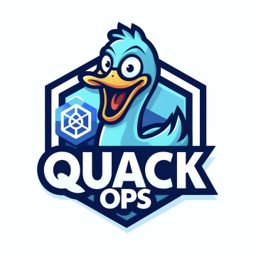

# Kubectl-QuackOps



**QuackOps** is a powerful kubectl AI-agent plugin designed to enhance your Kubernetes troubleshooting experience with advanced AI assistance. It acts as an intelligent agent, translating natural language queries into actionable insights by analyzing diagnostics directly from your current Kubernetes context.

Beyond simple question-answering, QuackOps provides a rich, interactive experience that enhances the standard command-line workflow. It maintains context throughout a session, allowing for follow-up questions and iterative troubleshooting. Need to inspect a specific resource mentioned in the AI's analysis? You can execute arbitrary kubectl commands directly within the QuackOps session by prefixing them with a command marker (default `$`, e.g., `$ kubectl describe deployment my-app`). This interactive shell includes familiar features like command history navigation using arrow keys and persistent history storage, making it easy to recall and reuse previous commands or prompts. Furthermore, built-in auto-completion aids in quickly formulating shell commands, streamlining the entire interaction.

## 🚀 Key Features

- **Multi-Model Support:** Choose the LLM that fits your requirements:
  - **[Ollama](https://ollama.com/)** - Run models locally for complete data privacy and air-gapped environments
  - **[Google Gemini](https://gemini.google.com/)** - Process massive outputs with 1M+ token context windows
  - **[OpenAI](https://openai.com/)** - Leverage cutting-edge models like o3 for complex diagnostics
  - **[Anthropic](https://anthropic.com/)** - Utilize Claude models for reliable technical analysis

- **Interactive Sessions:**
  - Execute arbitrary commands directly with the `$` prefix (e.g., `$ kubectl describe my-pod`)
  - Maintain context across multiple queries for deeper troubleshooting sessions
  - Chain commands and prompts together to analyze complex issues step-by-step
  - Auto-completion support for cli commands through tab completion

- **Security:**
  - **Secret Protection:** Automatically filters sensitive data from output sent to LLMs
  - **Safe Mode:** Review and approve commands before execution with `--safe-mode` flag
  - **Command Whitelisting:** Prevents destructive operations with configurable command restrictions

- **Syntax highlighting:**
  - Markdown-based output formatting with color-coded elements for better readability

- **History**:
- **MCP Client Mode (optional):**
  - Prefer external Model Context Protocol (MCP) tools for diagnostics (kubectl/bash and more)
  - Configurable via flags/env and `~/.config/quackops/mcp.yaml`
  - Strict mode to disable local fallback

  - Interactive shell-like experience with command history navigation (up/down arrows)
  - Persistent history storage in a configurable file (default: `~/.quackops/history`)
  - Easily recall previous prompts and commands across sessions

## 🔍 Use Cases

### For Developers:
- **Quick Debugging:** Identify application issues without extensive Kubernetes knowledge
- **Log Analysis:** Find and understand error patterns across distributed services
- **Resource Optimization:** Get recommendations for kubernetes resources based on actual usage
- **Configuration Validation:** Check for common misconfigurations in your deployments

### For DevOps/SRE:
- **Incident Response:** Rapidly diagnose production issues
- **Cluster Maintenance:** Get guidance on upgrades, migrations, and best practices
- **Security Auditing:** Identify potential security risks in your deployments

## 💻 Example

```sh
$ kubectl quackops -v 'find and resolve issues with pods'

kubectl get pods
-- NAME                                            READY   STATUS             RESTARTS        AGE
-- my-nginx-ingress-hello-world-6d8c5b76db-g5696   1/1     Running            14 (149m ago)   58d
-- test-21081                                      1/1     Running            22 (149m ago)   95d
-- example-hello-world-5cd56d45d5-8nh5x            1/1     Running            2 (149m ago)    17d
-- my-nginx-ingress-hello-world-64f78448bd-v567q   0/1     ImagePullBackOff   0               28d
--

kubectl get events
-- LAST SEEN   TYPE     REASON    OBJECT                                              MESSAGE
-- 4m45s       Normal   BackOff   pod/my-nginx-ingress-hello-world-64f78448bd-v567q   Back-off pulling image "nginx:v1.16.0"
--

Based on the information provided:
- The pod `my-nginx-ingress-hello-world-64f78448bd-v567q` is not working
because it is in the `ImagePullBackOff` status which means it is unable to
pull the specified image `nginx:v1.16.0`.

- The issue is likely related to the incorrect image specified or the image
not being available in the specified repository.

To resolve the issue, you can check the image availability, correct the image
name or tag, ensure the repository access is correct, and troubleshoot any
network issues that may be preventing the pod from pulling the image.
```

## 🛠️ Advanced Examples

### Complex Troubleshooting

```sh
$ kubectl quackops 'why is my ingress not routing traffic properly to backend services?'
```

### Performance Analysis

```sh
$ kubectl quackops 'identify pods consuming excessive CPU or memory in the production namespace'
```

### Security Auditing

```sh
$ kubectl quackops 'check for overly permissive RBAC settings in my cluster'
```

### Multi-Resource Analysis

```sh
$ kubectl quackops 'analyze the connection between my failing deployments and their dependent configmaps'
```

## 📦 Installation

QuackOps is packaged as a kubectl plugin, which is a standalone executable file whose name begins with `kubectl-`.
You can install it by moving the executable file to any directory included in your `$PATH`.

1. **Download the QuackOps binary**
   Head over to the [GitHub releases page](https://github.com/mikhae1/kubectl-quackops/releases) and download the latest release archive suitable for your operating system (e.g., `kubectl-quackops-linux-amd64.tar.gz`)

2. **Extract the binary**
   Use the following command to extract the binary from the downloaded archive:
   ```sh
   tar -xzf ~/Downloads/kubectl-quackops-linux-amd64.tar.gz -C ~/Downloads
   ```

3. **Make the binary executable** (if needed):
   ```sh
   chmod +x ~/Downloads/kubectl-quackops
   ```

4. **Move the binary to your `$PATH`:**
   Move the `kubectl-quackops` executable to a directory included in your system's `$PATH`, such as `/usr/local/bin`:
   ```sh
   sudo mv ~/Downloads/kubectl-quackops /usr/local/bin/kubectl-quackops
   ```

5. **Verify the installation:**
   Confirm that QuackOps is recognized as a kubectl plugin by running:
   ```sh
   kubectl plugin list
   ```

6. **Summon the quAck:**
   ```sh
   kubectl quackops
   ```

## 📜 Prompt History

QuackOps automatically stores your prompt history to enable easy access to previous queries:

- **Persistent History:** Your previous prompts are saved to a history file (default: `~/.quackops/history`) and will be available across sessions.
- **History Navigation:** Use up and down arrow keys to navigate through your command history.
- **Customizable:** Control the history file location with `--history-file` option or disable history completely with `--disable-history`.

This feature helps you:
- Quickly recall complex queries without retyping
- Build on previous troubleshooting sessions
- Maintain a record of your cluster diagnostics

### Examples

```sh
# Specify a custom history file location
kubectl quackops --history-file ~/.my_custom_history

# Disable history storage entirely
kubectl quackops --disable-history
```

## 🔄 Shell Completions

QuackOps provides intelligent tab completion for command execution mode (commands starting with `$`), leveraging bash-compatible shell completions:

- **Command Completions:** When typing `$ `, type and press Tab to see available commands.
- **Argument Completions:** QuackOps supports completions for cli tools like `kubectl`, `helm`, and other CLI tools that implement completion.
- **File Path Completions:** Automatically complete file paths when navigating the filesystem.

Note that completions rely on bash-compatible shell completion functions being available on your system. The feature works best in environments where bash completion is properly configured.

### Example Usage

```sh
$ kubectl <tab>              # Shows kubectl subcommands
$ kubectl get po<tab>        # Completes to 'pods'
$ kubectl get pods -n <tab>  # Shows available namespaces
```

## 🌟 Supported LLMs

QuackOps offers flexible options to tailor your Kubernetes troubleshooting experience.
Choose the LLM provider that best suits your needs.

### Ollama: Local Models for Privacy and Control

For maximum data security, leverage the power of local LLMs with [Ollama](https://ollama.com/).

**Benefits:**

* **Data Sovereignty:** Keep your cluster information confidential. Data remains within your environment, enhancing privacy.
* **Enhanced Security:** Maintain complete control over access and security protocols for your Kubernetes data.
* **Air-Gapped Operation:** Run in environments with no internet connectivity.
* **No API Costs:** Eliminate dependency on external API services and associated costs.

**Getting Started:**

1. **Install Ollama:** Download and install Ollama from [https://ollama.com/download](https://ollama.com/download).

2. **Start ollama server:**
   ```sh
   ollama serve
   ```

3. **Download local LLM model** (e.g., `llama3.1`, `deepseek-r1`):
   ```sh
   ollama run deepseek-r1:8b
   ```

4. **Start interactive chat:**
   ```sh
   kubectl quackops -p ollama
   ```

### OpenAI: Cutting-Edge AI Models

For users seeking the most advanced AI capabilities.

**Benefits:**
- **Advanced Reasoning:** Solve complex cluster issues with sophisticated models
- **Access the Latest Models:** Leverage the latest advancements in LLMs, constantly updated and refined by OpenAI
- **Superior Context Understanding:** Better comprehension of complex Kubernetes architectures and dependencies
- **Multi-step Troubleshooting:** Handle complex diagnostics requiring multiple steps of reasoning

**Getting Started:**

1. **Obtain an API Key:** Get your OpenAI API key at [https://platform.openai.com/api-keys](https://platform.openai.com/api-keys).

2. **Set the API Key:**
   ```sh
   export OPENAI_API_KEY=<YOUR-OPENAI-API-KEY>
   ```

3. **Start QuackOps:**
   ```sh
   kubectl quackops -p openai -m gpt-4o -x 4096
   ```

### Google: Large Contexts

For users requiring extensive context analysis and handling large command outputs.

**Benefits:**
- **Massive Context Windows:** Process more information at once with Gemini's 1M+ token context window
- **Efficient RAG:** Superior handling of long command outputs and cluster state analysis
- **Cost-Effective:** Competitive pricing for enterprise-grade AI capabilities
- **Comprehensive Analysis:** Analyze outputs from multiple resources simultaneously (pods, services, deployments, etc.)

**Getting Started:**

1. **Obtain an API Key:** Get your Google AI API key at [https://makersuite.google.com/app/apikey](https://makersuite.google.com/app/apikey)

2. **Set the API Key:**
   ```sh
   export GOOGLE_API_KEY=<YOUR-GOOGLE-API-KEY>
   ```

3. **Start QuackOps:**
   ```sh
   kubectl quackops -p google -m gemini-2.0-flash-thinking-exp
   ```

### Anthropic: Reliable Technical Analysis

For users requiring clear explanations and technical reliability.

**Benefits:**
- **Clear Explanations:** Receive clear, technically precise explanations of complex issues
- **Consistent Outputs:** More predictable response quality for mission-critical diagnostics
- **Structured Analysis:** Well-organized recommendations for methodical troubleshooting
- **Low Hallucination Rate:** Higher accuracy when analyzing complex Kubernetes states

**Getting Started:**

1. **Obtain an API Key:** Get your Anthropic API key at [https://console.anthropic.com/](https://console.anthropic.com/)

2. **Set the API Key:**
   ```sh
   export ANTHROPIC_API_KEY=<YOUR-ANTHROPIC-API-KEY>
   ```

3. **Start QuackOps:**
   ```sh
   kubectl quackops -p anthropic -m claude-3-opus-20240229
   ```

## ⚙️ Configuration Options

QuackOps is highly configurable through environment variables or command-line flags:

### Environment Variables

| Variable | Type | Default | Description |
|----------|------|---------|-------------|
| `OPENAI_API_KEY` | string |  | OpenAI API key (required for `openai` provider) |
| `GOOGLE_API_KEY` | string |  | Google AI API key (required for `google` provider) |
| `ANTHROPIC_API_KEY` | string |  | Anthropic API key (required for `anthropic` provider) |
| `QU_COMMAND_PREFIX` | string | `$` | Single-character prefix to enter command mode and mark shell commands |
| `QU_LLM_PROVIDER` | string | `ollama` | LLM model provider (`ollama`, `openai`, `google`, `anthropic`) |
| `QU_LLM_MODEL` | string | provider-dependent | LLM model to use. Defaults: `llama3.1` (ollama), `gpt-4o-mini` (openai), `gemini-2.5-flash-preview-04-17` (google), `claude-3-5-sonnet-latest` (anthropic) |
| `QU_API_URL` | string | `http://localhost:11434` | LLM API base URL (used with `ollama`) |
| `QU_SAFE_MODE` | bool | `false` | Require confirmation before executing commands |
| `QU_KUBECTL_BINARY` | string | `kubectl` | Path to the kubectl binary |
| `QU_RETRIES` | int | `3` | Number of retries for kubectl commands |
| `QU_TIMEOUT` | int | `30` | Timeout for kubectl commands (seconds) |
| `QU_MAX_TOKENS` | int | provider-dependent | Max tokens in LLM context window. Defaults: `4096` (ollama), `128000` (openai/google), `200000` (anthropic) |
| `QU_TEMPERATURE` | float | `0.0` | Temperature for LLM generation |
| `QU_ALLOWED_KUBECTL_CMDS` | []string | see `defaultAllowedKubectlCmds` | Comma-separated allowlist of kubectl command prefixes |
| `QU_BLOCKED_KUBECTL_CMDS` | []string | see `defaultBlockedKubectlCmds` | Comma-separated denylist of kubectl command prefixes |
| `QU_KUBECTL_BLOCKED_CMDS_EXTRA` | string |  | Extra comma-separated kubectl command prefixes to block |
| `QU_DISABLE_MARKDOWN_FORMAT` | bool | `false` | Disable Markdown formatting and colorization |
| `QU_DISABLE_ANIMATION` | bool | `false` | Disable typewriter animation effect |
| `QU_MAX_COMPLETIONS` | int | `50` | Maximum number of completions to display |
| `QU_HISTORY_FILE` | string | `~/.quackops/history` | Path to the history file |
| `QU_DISABLE_HISTORY` | bool | `false` | Disable storing prompt history in a file |
| `QU_EMBEDDING_MODEL` | string | provider-dependent | Embedding model. Defaults: `models/text-embedding-004` (google), `text-embedding-3-small` (openai), `nomic-embed-text` (anthropic); for `ollama`, see `QU_OLLAMA_EMBEDDING_MODELS` |
| `QU_OLLAMA_EMBEDDING_MODELS` | string | `nomic-embed-text,mxbai-embed-large,all-minilm-l6-v2` | Comma-separated list of Ollama embedding models |
| `QU_KUBECTL_SYSTEM_PROMPT` | string | see `defaultKubectlStartPrompt` | Start prompt for kubectl command generation |
| `QU_KUBECTL_SHORT_PROMPT` | string | code default | Short prompt for kubectl command generation |
| `QU_KUBECTL_SHORT_PROMPT_2` | string | code default | Secondary short prompt for kubectl command generation |
| `QU_KUBECTL_FORMAT_PROMPT` | string | see `defaultKubectlFormatPrompt` | Format prompt for kubectl command generation |
| `QU_DIAGNOSTIC_ANALYSIS_PROMPT` | string | see `defaultDiagnosticAnalysisPrompt` | Prompt for diagnostic analysis |
| `QU_MARKDOWN_FORMAT_PROMPT` | string | "Format your response using Markdown, including headings, lists, and code blocks for improved readability in a terminal environment." | Markdown formatting guidance |
| `QU_PLAIN_FORMAT_PROMPT` | string | "Provide a clear, concise analysis that is easy to read in a terminal environment." | Plain text formatting guidance |
| `QU_MCP_CLIENT` | bool | `true` | Enable MCP client mode to use external MCP servers for tools |
| `QU_MCP_CONFIG` | string | `~/.config/quackops/mcp.yaml` | Path to MCP client configuration file |
| `QU_MCP_TOOL_TIMEOUT` | int | `30` | Timeout for MCP tool calls (seconds) |
| `QU_MCP_MAX_TOOL_CALLS` | int | `10` | Maximum iterative MCP tool calls per model response |
| `QU_MCP_STRICT` | bool | `false` | Strict MCP mode: do not fall back to local execution when MCP fails |
| `QU_ALLOWED_TOOLS` | []string | `*` | Comma-separated allowlist of tool names when invoking via MCP (`*` = allow all) |
| `QU_DENIED_TOOLS` | []string |  | Comma-separated denylist of tool names when invoking via MCP |
| `QU_TOOL_OUTPUT_MAX_LINES` | int | `40` | Maximum number of lines to show in MCP tool output blocks |
| `QU_TOOL_OUTPUT_MAX_LINE_LEN` | int | `140` | Maximum line length to show in MCP tool output blocks |

### Command-Line Flags

| Flag | Description | Default |
|------|-------------|---------|
| `-p, --provider` | LLM model provider (e.g., 'ollama', 'openai', 'google', 'anthropic') | `ollama` |
| `-m, --model` | LLM model to use | Provider-dependent |
| `-u, --api-url` | URL for LLM API (used with 'ollama' provider) | `http://localhost:11434` |
| `-s, --safe-mode` | Enable safe mode to prevent executing commands without confirmation | `false` |
| `-r, --retries` | Number of retries for kubectl commands | `3` |
| `-t, --timeout` | Timeout for kubectl commands in seconds | `30` |
| `-x, --max-tokens` | Maximum number of tokens in LLM context window | `4096` |
| `-v, --verbose` | Enable verbose output | `false` |
| `-c, --disable-secrets-filter` | Disable filtering sensitive data in secrets from being sent to LLMs | `false` |
| `-d, --disable-markdown` | Disable Markdown formatting and colorization of LLM outputs | `false` |
| `-a, --disable-animation` | Disable typewriter animation effect for LLM outputs | `false` |
| `--disable-history` | Disable storing prompt history in a file | `false` |
| `--history-file` | Path to the history file | `~/.quackops/history` |
| `--mcp-client` | Enable MCP client mode | `false` |
| `--mcp-config` | Path to MCP client YAML | `~/.config/quackops/mcp.yaml` |
| `--mcp-tool-timeout` | Timeout for MCP tools (seconds) | `30` |
| `--mcp-strict` | Strict MCP mode (no fallback) | `false` |

### MCP Configuration (YAML)

Create `~/.quackops/mcp.json`:

```json
{
  "mcpServers": {
    "kubeview-mcp": {
      "command": "npx",
      "args": [
        "-y",
        "https://github.com/mikhae1/kubeview-mcp"
      ],
      "env": {
        "KUBECONFIG": "/Users/mikhae1/.kube/config"
      }
    }
  }
}```

In MCP mode, QuackOps prefers MCP tools for diagnostics, with optional strict mode to avoid local fallback. Tools can be restricted using `QU_ALLOWED_TOOLS`/`QU_DENIED_TOOLS`.

## 🛡️ Security Considerations

QuackOps is designed with security in mind, but there are important considerations for using it in production environments:

- **Use Read-Only Kubernetes Users:** For maximum safety, operate with a read-only Kubernetes user when interacting with the cluster through this plugin.

- **Enable Safe Mode:** In production environments, activate the `--safe-mode` option to ensure all commands are manually reviewed before execution.

- **Data Privacy:** By default, QuackOps filters sensitive data from secrets before sending to LLMs. Disable this only if you understand the implications.

- **Command Restrictions:** The tool prevents execution of potentially destructive commands. Configure additional blocked commands with the `QU_KUBECTL_BLOCKED_CMDS_EXTRA` environment variable.

- **Local Models:** For sensitive environments, use Ollama with local models to ensure your cluster data never leaves your infrastructure.

## 🤝 Contributing

Contributions are welcome! See [CONTRIBUTING.md](CONTRIBUTING.md) for details on how to get started.

## 📜 License

This project is licensed under the MIT License.
